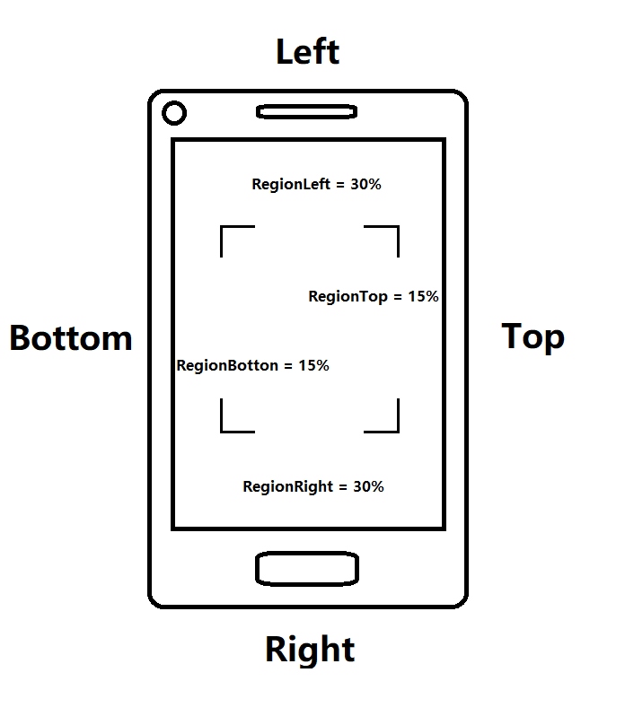

# Android General Settings Sample

The general setting sample shows how to make the general settings via `PublicRuntimeSetting` class when using Dynamsoft Barcode Reader. This General Settings sample is also available for the popular mobile frameworks.

**View Samples (on GitHub)**

- [Java (Android) General Settings Sample]()
- [Xamarins General Settings Sample]()
- [Cordova General Settings Sample]()
- [React-native General Settings Sample]()
- [Flutter General Settings Sample]()

## The Barcode Settings

The barcode formats settings and the barcode count settings are the most basic settings that determine the readability of your scan app. These parameters are all available for users to make changes through the class `PublicRuntimeSettings`. To view the all available barcode formats, please view the enumeration `BarcodeFormat` and `BarcodeFormat_2`.

**Code Snippet**

```java
PublicRuntimeSettings runtimeSettings = reader.getRuntimeSettings();
runtimeSettings.barcodeFormatIds = EnumBarcodeFormat.BF_ONED | EnumBarcodeFormat.BF_PDF417 | EnumBarcodeFormat.BF_QR_CODE | EnumBarcodeFormat.BF_DATAMATRIX |EnumBarcodeFormat.BF_AZTEC;
runtimeSettings.barcodeFormatIds_2 = 0;
reader.updateRuntimeSettings(runtimeSettings);
```

**Related APIs**

- Class [`PublicRuntimeSettings`]({{ site.android_api }}auxiliary-PublicRuntimeSettings.html)
- Enum [`BarcodeFormat`]({{ site.enumerations }}format-enums.html#barcodeformat)
- Enum [`BarcodeFormat_2`]({{ site.enumerations }}format-enums.html#barcodeformat_2)

## The Scan Region Settings

The scan region information is stored in `RegionDefinition` class. To set the scan region, you can make the region settings in class `RegionDefinition` and upload the settings through the class `PublicRuntimeSettings`.

Please note, the orientation of mobile frame is always Rotated 90 degrees counterclockwise from the orientation from of your device. The following image is illustrating the mobile frames' orientation.

<div align="center">
    <p></p>
    <p>Region Orientation</p>
</div>

The `regionTop`, `regionBottom`, `regionLeft` and `regionRight` parameters in the class `RegionDefinition` stand for the region of frame but not the device. Therefore, please makesure that you are setting the correct parameters for the border of your scan region. For example if you are going to create a scan region that margins 30% from the top and bottom of the frame. Actually, you have to set the `regionLeft` 30 to make the bottom of the scan region margin 30% from the top of the mobile screen.

**Code Snippet**

```java
PublicRuntimeSettings runtimeSettings = reader.getRuntimeSettings();
RegionDefinition regionDefinition = new RegionDefinition();
//The int value 15 means the top of the scan region margins 15% from the top of screen.
regionDefinition.regionTop = 15;
regionDefinition.regionBottom = 85;
regionDefinition.regionLeft = 30;
regionDefinition.regionRight = 70;
regionDefinition.regionMeasuredByPercentage = 1;
runtimeSettings.region = regionDefinition;
reader.updateRuntimeSettings(runtimeSettings);
```

<div align="center">
    <p></p>
    <p>How to Configure the Scan Region</p>
</div>

**Related APIs**

- Class [`RegionDefinition`]({{ site.android_api }}auxiliary-RegionDefinition.html)
- Class [`PublicRuntimeSettings`]({{ site.android_api }}auxiliary-PublicRuntimeSettings.html)

## To Updated the Settings

The `PublicRuntimeSettings` class is the class that stores nearly all the barcode reading setting parameters. These parameters cover the basic barcode format settings as well as further algorithm configuring parameters.

**Update the settings via the APIs**

```java
PublicRuntimeSettings runtimeSettings = reader.getRuntimeSettings();
runtimeSettings.barcodeFormatIds = EnumBarcodeFormat.BF_ONED;
runtimeSettings.expectedBarcodesCount = 1;
reader.updateRuntimeSettings(runtimeSettings);
```

**Update the runtime settings via Json String**

```java
reader.initRuntimeSettingsWithString("{\"Version\":\"3.0\", \"ImageParameter\":{\"Name\":\"IP1\", \"BarcodeFormatIds\":[\"BF_QR_CODE\"], \"ExpectedBarcodesCount\":10}}", EnumConflictMode.CM_OVERWRITE);
```

**Update the runtime settings via Json File**

```java
// Overwrite the settings if the settings already exist.
reader.initRuntimeSettingsWithFile("your template file path", EnumConflictMode.CM_OVERWRITE);
```

- Class [`PublicRuntimeSettings`]({{ site.android_api }}auxiliary-PublicRuntimeSettings.html)
- Method [`updateRuntimeSettings`]({{ site.android_api }}primary-parameter-and-runtime-settings-basic.html#updateruntimesettings)
- Method [`initRuntimeSettingsWithString`]({{ site.android_api }}primary-parameter-and-runtime-settings-advanced.html#initruntimesettingswithstring)
- Method [`initRuntimeSettingsWithFile`]({{ site.android_api }}primary-parameter-and-runtime-settings-advanced.html#initruntimesettingswithfile)
